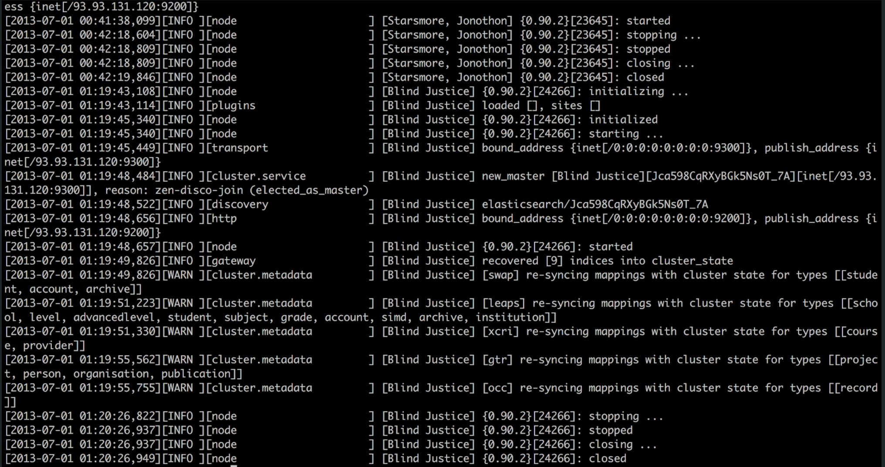

theme: Ostrich
footer: 
autoscale: true

## The evolution of web monitoring

# 

### @emanuil_tolev

^ Community engineer at Elastic.

---

## History

## Present innovation

## Future

---

# 

^ Logs

---

# 

^ Hmm

---

# 

^ Well, this is getting challenging to manage

---

# 

^ Very challenging

---

# 

^ metrics

---

# 
^ apm

---

### The story of monitoring is a story of frustration, facepalming and painful moments of reflection

^ Personal story of managing logs and evolving systems

---

# Now:

- Monitoring
  - Logging
  - Metrics
  - Tracing
  - Security?

- Observability

^ Elastic is adding security.

---

# 

^ we already collect this data anyway, why not use it to secure the systems too. Note you will need special skills though to use a SIEM.

---

# 

^ Credit to Stackify.com . https://stackify.com/best-log-management-tools/

---

# Observability

### https://www.honeycomb.io/blog/observability-a-manifesto/

^ Recommend reading that link if you have not, for a new and different angle. Take a picture now.

^ Charity Majors from Honeycomb.io [READ VERBATIM!]: "The power to ask new questions of your system, without having to ship new code or gather new data in order to ask those new questions"
^ "Monitoring is about known-unknowns and actionable alerts, observability is about unknown-unknowns and empowering you to ask arbitrary new questions and explore where the cookie crumbs take you. Observability means you can understand how your systems are working on the inside just by asking questions from outside."

---

# Present innovation

- Features
- Business models
- Strategic view of ops pain & relief

---

# 

^ Kind of hard to explain but basically it's a service diagram like you would see in Newrelic and Datadog etc. but. This one overlays the deepest layer (furthest back) at which a specific error is detected. This screenshot shows trying to diagnose a specific problem, it's from their public demo.

---

#   

^ Shows what you yourself looked at - useful at retro. Shows what other ppl looked at - collaborative. Encapsulates team knowledge. An advanced version could be used for training juniors? Writing disaster recovery playbooks straight in your troubleshooting tool?

---

# 

^ Paid but we are talking about innovation of any kind. This is very cool. Anomaly detection. Unlabeled, I didn't tell it to look at user.name and transaction.name - it thinks there is correlation between slowdown and these features in the dataset.

---

# 

^ a view of the model

---

# Business models

Variety: charge per node / data volume / data storage / compute / Ops user, ...

^ Vary. Elastic tends to aim for resources used rather than per collector agent running.

---

# Strategic view

- Honeycomb: events, structured info rather than logs, unknown unknowns, the system teaches us
- Elastic and Splunk: one-stop shop (but pricing varies by orders of magnitude in diff use cases)
- Many others

^ The very framing itself changes how the companies look at things. Honeycomb, Lightspeed and Elastic APM likely cannot be compared head to head because the philosophical (or framing) differences run too deep.

---

# The Future

- in-depth comparison of vendors?
- trying every tool available and writing a book?
- product managers @ vendors decide where next?
- time-tested method: go rant at several conferences about your own frustrations!

^ nobody got time for that first one. Nobody practicing ops actively, plus I can't do it while working for a vendor. No time for 2nd item either I reckon.
^ if you have opinions, some vendors do listen and hear them, easiest way to influence.
^ of course, remember to rant at us^H^H give feedback ;). etolev@elastic.co
